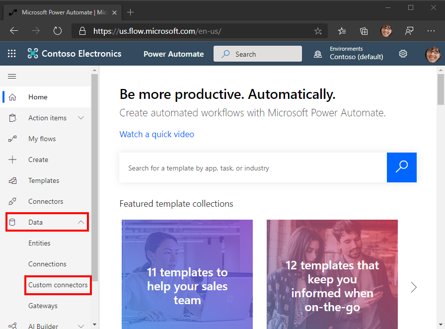
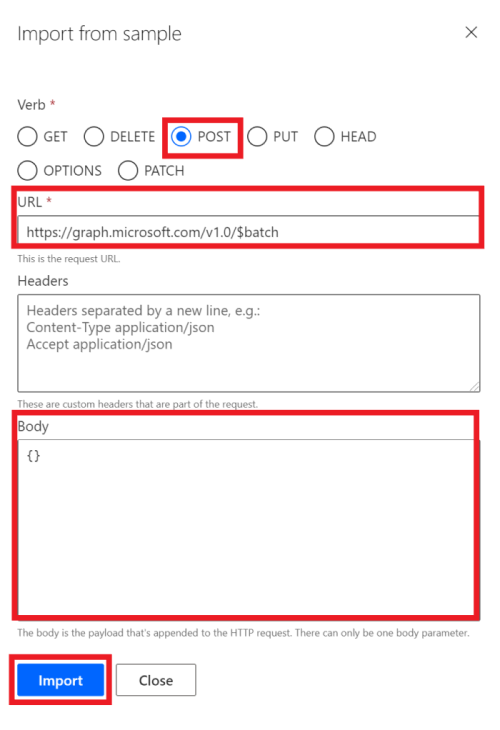
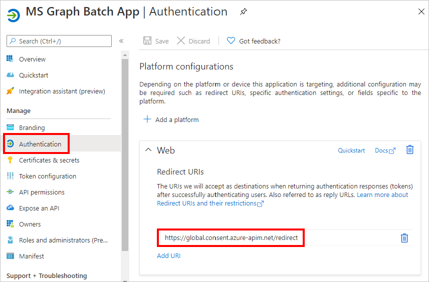

<!-- markdownlint-disable MD002 MD041 -->

In dieser Übung erstellen Sie einen neuen benutzerdefinierten Connector, der in Microsoft Power Automation oder in Azure Logic-Apps verwendet werden kann. Die OpenAPI-Definitionsdatei ist mit dem korrekten Pfad für den Microsoft Graph `$batch` -Endpunkt und zusätzlichen Einstellungen für den einfachen Import vordefiniert.

Es gibt zwei Optionen zum Erstellen eines benutzerdefinierten Connectors für Microsoft Graph:

- Erstellen aus leer
- Importieren einer OpenAPI-Datei

## Option 1: Erstellen eines benutzerdefinierten Connectors aus einer leeren Vorlage

Öffnen Sie einen Browser, und navigieren Sie zu [Microsoft Power Automation](https://flow.microsoft.com). Melden Sie sich mit Ihrem Office 365 mandantenadministrator Konto an. Wählen Sie im linken Menü **Daten** aus, und wählen Sie im Dropdownmenü das Element **benutzerdefinierte Konnektoren** aus.

Klicken Sie auf der Seite **benutzerdefinierte Connectors** auf den Link **neuer benutzerdefinierter Verbinder** in der oberen rechten Ecke, und wählen Sie dann im Dropdownmenü die Option **aus leeres Element erstellen aus** .

Geben Sie `MS Graph Batch Connector` in das Textfeld **Connector Name** ein. Choose **Continue**.

Füllen Sie auf der Seite Connector-Konfigurations **Allgemein** die Felder wie folgt aus.

- **Schema** : https
- **Host** : `graph.microsoft.com`
- **Basis-URL** : `/`

Klicken Sie auf **Sicherheits** Schaltfläche, um fortzufahren.

Füllen Sie auf der Seite **Sicherheit** die Felder wie folgt aus.

- **Wählen Sie aus, welche Authentifizierung von ihrer API implementiert wird** : `OAuth 2.0`
- **Identitätsanbieter** : `Azure Active Directory`
- **Client-ID** : die Anwendungs-ID, die Sie in der vorherigen Übung erstellt haben
- **Geheimer Client** Schlüssel: der Schlüssel, den Sie in der vorherigen Übung erstellt haben
- **Anmelde-URL** : `https://login.windows.net`
- **Mandanten-ID** : `common`
- **Ressourcen-URL** : `https://graph.microsoft.com` (kein Trailing/)
- **Bereich** : leer lassen

Klicken Sie auf die Schaltfläche **Definition** , um fortzufahren.

Wählen Sie auf der Seite **Definition** die Option **neue Aktion** aus, und füllen Sie die Felder wie folgt aus.

- **Zusammenfassung** : `Batch`
- **Beschreibung** : `Execute Batch with Delegate Permission`
- **Vorgangs-ID** : `Batch`
- **Sichtbarkeit** : `important`

Erstellen Sie eine **Anforderung** durch Auswählen von **Import aus Sample** und füllen Sie die Felder wie folgt aus.

- **Verb** : `POST`
- **URL** : `https://graph.microsoft.com/v1.0/$batch`
- **Kopfzeilen** : leer lassen
- **Body** : `{}`

Wählen Sie **Importieren** aus.

Wählen Sie oben rechts " **Connector erstellen** " aus. Nachdem der Connector erstellt wurde, kopieren Sie die generierte **Umleitungs-URL** aus der **Sicherheits** Seite.

Kehren Sie zur registrierten Anwendung im [Azure-Portal](https://aad.portal.azure.com) zurück, das Sie in der vorherigen Übung erstellt haben. Wählen Sie im Menü auf der linken Seite **Authentifizierung** aus. Wählen Sie **Plattform hinzufügen** aus, und wählen Sie dann **Web** aus. Geben Sie die Umleitungs-URL, die aus dem vorherigen Schritt in den **Umleitungs-URIs** kopiert wurde, dann **configure** ein.

## Option 2: Erstellen eines benutzerdefinierten Connectors durch Importieren der OpenAPI-Datei

Erstellen Sie mithilfe eines Text-Editors eine neue leere Datei mit dem Namen, `MSGraph-Delegate-Batch.swagger.json` und fügen Sie den folgenden Code hinzu.

[!code-json]

Öffnen Sie einen Browser, und navigieren Sie zu [Microsoft Power Automation](https://flow.microsoft.com). Melden Sie sich mit Ihrem Office 365 mandantenadministrator Konto an. Wählen Sie im linken Menü **Daten** aus, und wählen Sie im Dropdownmenü das Element **benutzerdefinierte Konnektoren** aus.

Klicken Sie auf der Seite **benutzerdefinierte Connectors** auf den Link **neuer benutzerdefinierter Verbinder** in der oberen rechten Ecke, und wählen Sie dann im Dropdownmenü das Element **OpenAPI-Datei importieren** aus.

Geben Sie `MS Graph Batch Connector` in das Textfeld **Connector Name** ein. Wählen Sie das Ordnersymbol aus, um die OpenAPI-Datei hochzuladen. Wechseln Sie zu der Datei, die `MSGraph-Delegate-Batch.swagger.json` Sie erstellt haben. Wählen Sie **weiter** aus, um die OpenAPI-Datei hochzuladen.

Klicken Sie auf der Seite Connector-Konfiguration im Navigationsmenü auf den Link **Sicherheit** . Füllen Sie die Felder wie folgt aus.

- **Wählen Sie aus, welche Authentifizierung von ihrer API implementiert wird** : `OAuth 2.0`
- **Identitätsanbieter** : `Azure Active Directory`
- **Client-ID** : die Anwendungs-ID, die Sie in der vorherigen Übung erstellt haben
- **Geheimer Client** Schlüssel: der Schlüssel, den Sie in der vorherigen Übung erstellt haben
- **Anmelde-URL** : `https://login.windows.net`
- **Mandanten-ID** : `common`
- **Ressourcen-URL** : `https://graph.microsoft.com` (kein Trailing/)
- **Bereich** : leer lassen

Wählen Sie oben rechts " **Connector erstellen** " aus. Nachdem der Connector erstellt wurde, kopieren Sie die generierte **Umleitungs-URL**.

Kehren Sie zur registrierten Anwendung im [Azure-Portal](https://aad.portal.azure.com) zurück, das Sie in der vorherigen Übung erstellt haben. Wählen Sie im Menü auf der linken Seite **Authentifizierung** aus. Wählen Sie **Plattform hinzufügen** aus, und wählen Sie dann **Web** aus. Geben Sie die Umleitungs-URL, die aus dem vorherigen Schritt in den **Umleitungs-URIs** kopiert wurde, dann **configure** ein.

