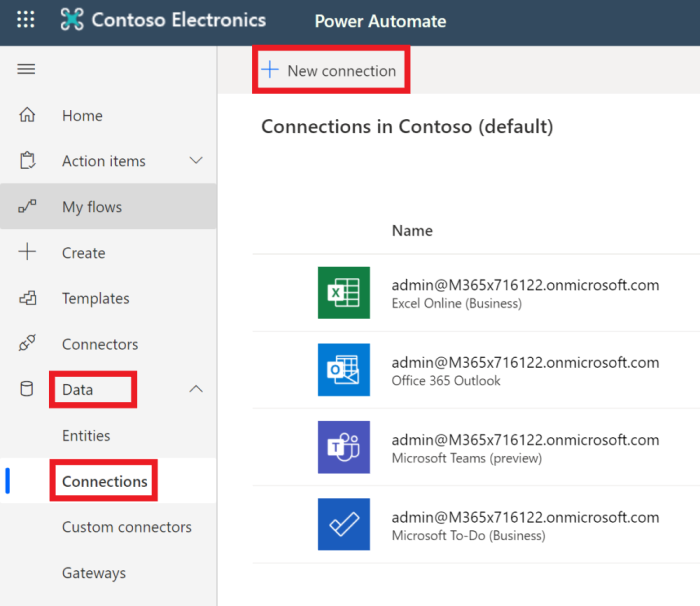

<!-- markdownlint-disable MD002 MD041 -->

Der abschließende Konfigurationsschritt, um sicherzustellen, dass der Connector einsatzfähig ist, besteht darin, den benutzerdefinierten Connector zu autorisieren und zu testen, um eine zwischengespeicherte Verbindung zu erstellen.The final configuration step to ensure the connector is ready for use is to authorize and test the custom connector to create a cached connection.

> [!IMPORTANT]
> Für die folgenden Schritte müssen Sie mit Administratorrechten angemeldet sein.The following steps requires that you are logged in with administrator privileges.

Wechseln Sie in [Microsoft Power automatisieren](https://flow.microsoft.com)zum Menüelement **Daten** auf der linken Seite, und wählen Sie die Seite **Verbindungen** aus.In [Microsoft Power Automate](https://flow.microsoft.com), go to the **Data** menu item on the left and choose the **Connections** page. Klicken Sie auf den Link **neue Verbindung** .Choose the **New Connection** link.

Suchen Sie Ihren benutzerdefinierten Connector, und schließen Sie die Verbindung ab, indem Sie auf die Schaltfläche Plus klicken.Find your custom connector and complete the connection by clicking the plus button. Melden Sie sich mit dem Azure Active Directory-Konto des Office 365 Mandanten Administrators an.Sign in with your Office 365 tenant administrator's Azure Active Directory account.

Wenn Sie zur Eingabe der erforderlichen Berechtigungen aufgefordert werden, überprüfen Sie die **Zustimmung im Namen Ihrer Organisation** , und wählen Sie dann **akzeptieren** aus, um Berechtigungen zu autorisieren.When prompted for the requested permissions, check **Consent on behalf of your organization** and then choose **Accept** to authorize permissions.

Nachdem Sie die Berechtigungen autorisiert haben, wird eine Verbindung in Power Automation erstellt.After you authorize the permissions, a connection is created in Power Automate.

Der benutzerdefinierte Connector ist jetzt konfiguriert und aktiviert.The custom connector is now configured and enabled. Es kann eine Verzögerung bei der Anwendung und Verfügbarkeit von Berechtigungen geben, aber der Connector ist jetzt konfiguriert.There may be a delay in permissions being applied and available, but the connector is now configured.
