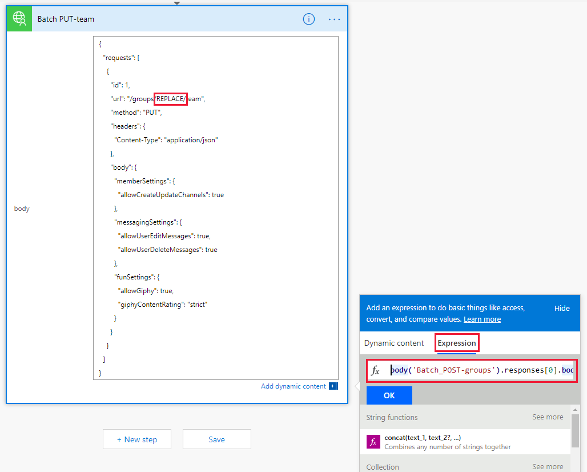
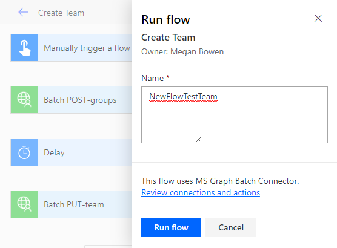

<!-- markdownlint-disable MD002 MD041 -->

In dieser Übung erstellen Sie einen Fluss für die Verwendung des benutzerdefinierten Konnektors, den Sie in den vorherigen Übungen erstellt haben, um ein Microsoft-Team zu erstellen und zu konfigurieren. Der Fluss verwendet den benutzerdefinierten Connector zum Senden einer POST-Anforderung, um eine Office 365 Unified Group zu erstellen, wird für eine Verzögerung angehalten, während die Gruppenerstellung abgeschlossen wird, und sendet dann eine PUT-Anforderung, um die Gruppe einem Microsoft-Team zuzuordnen.

Am Ende sieht der Fluss ähnlich wie in der folgenden Abbildung aus:


Öffnen Sie [Microsoft Power Automation](https://flow.microsoft.com) in Ihrem Browser, und melden Sie sich mit Ihrem Office 365 mandantenadministrator Konto an. Wählen Sie **meine Flows** in der linken Navigationsleiste aus. Wählen Sie **neu** und dann **sofort--von leer aus**. Geben Sie `Create Team` für den **Flussnamen** ein, und wählen Sie dann unter Wählen Sie aus **, wie dieser Fluss ausgelöst** wird **einen Fluss manuell auslösen** aus. Klicken Sie auf **Erstellen**.

Wählen Sie das **manuelle Auslösen eines Fluss** Elements aus, wählen Sie dann **Eingabe hinzufügen** aus, wählen Sie **Text** aus, und geben Sie `Name` als Titel ein.


Wählen Sie **neuer Schritt** aus, und geben Sie `Batch` das Suchfeld ein. Fügen Sie die **MS Graph Batch Connector** -Aktion hinzu. Wählen Sie die Auslassungspunkte aus, und benennen Sie diese Aktion um `Batch POST-groups` .

Fügen **Sie den folgenden Code in das Feld** Text der Aktion ein.

```json
{
  "requests": [
    {
      "url": "/groups",
      "method": "POST",
      "id": 1,
      "headers": { "Content-Type": "application/json" },
      "body": {
        "description": "REPLACE",
        "displayName": "REPLACE",
        "groupTypes": ["Unified"],
        "mailEnabled": true,
        "mailNickname": "REPLACE",
        "securityEnabled": false
      }
    }
  ]
}
```

Ersetzen Sie die einzelnen `REPLACE` Platzhalter durch Auswählen des `Name` Werts aus dem manuellen Auslöser aus dem Menü **dynamischer Inhalt hinzufügen** .


Wählen Sie **neuer Schritt** aus, suchen Sie nach `delay` einer **Verzögerungs** Aktion, und konfigurieren Sie Sie für 1 Minute.

Wählen Sie **neuer Schritt** aus, und geben Sie `Batch` das Suchfeld ein. Fügen Sie die **MS Graph Batch Connector** -Aktion hinzu. Wählen Sie die Auslassungspunkte aus, und benennen Sie diese Aktion um `Batch PUT-team` .

Fügen **Sie den folgenden Code in das Feld** Text der Aktion ein.

```json
{
  "requests": [
    {
      "id": 1,
      "url": "/groups/REPLACE/team",
      "method": "PUT",
      "headers": {
        "Content-Type": "application/json"
      },
      "body": {
        "memberSettings": {
          "allowCreateUpdateChannels": true
        },
        "messagingSettings": {
          "allowUserEditMessages": true,
          "allowUserDeleteMessages": true
        },
        "funSettings": {
          "allowGiphy": true,
          "giphyContentRating": "strict"
        }
      }
    }
  ]
}
```

Wählen Sie den `REPLACE` Platzhalter aus, und wählen Sie dann im Bereich dynamischer Inhalt den **Begriff Ausdruck** aus. Fügen Sie die folgende Formel in den **Ausdruck** ein.

```js
body('Batch_POST-groups').responses[0].body.id
```



Diese Formel gibt an, dass die Gruppen-ID aus dem Ergebnis der ersten Aktion verwendet werden soll.


Wählen Sie **Speichern** aus, und wählen Sie dann **Test** aus, um den Fluss auszuführen.

> [!TIP]
> Wenn ein Fehler wie angezeigt `The template validation failed: 'The action(s) 'Batch_POST-groups' referenced by 'inputs' in action 'Batch_2' are not defined in the template'` wird, ist der Ausdruck falsch und verweist wahrscheinlich auf eine Fluss Aktion, die nicht gefunden werden kann. Stellen Sie sicher, dass der Name der Aktion, auf die verwiesen wird, genau übereinstimmt.

Wählen Sie das Optionsfeld **Ich werde das Trigger** -Aktion ausführen aus, und wählen Sie **& Test speichern** aus. Wählen Sie im Dialogfeld **weiter** aus. Geben Sie einen Namen ohne Leerzeichen ein, und wählen Sie **Lauf Fluss** aus, um ein Team zu erstellen.



Klicken Sie abschließend auf **Fertig** , um das Aktivitätsprotokoll anzuzeigen. Nachdem der Fluss abgeschlossen ist, wurden Ihre Office 365 Gruppe und Ihr Team konfiguriert. Wählen Sie die Batch Aktionselemente aus, um die Ergebnisse der JSON-Batch Aufrufe anzuzeigen. Die `outputs` der `Batch PUT-team` Aktion sollte den Statuscode 201 für eine erfolgreiche Team Zuordnung ähnlich wie in der Abbildung unten haben.


