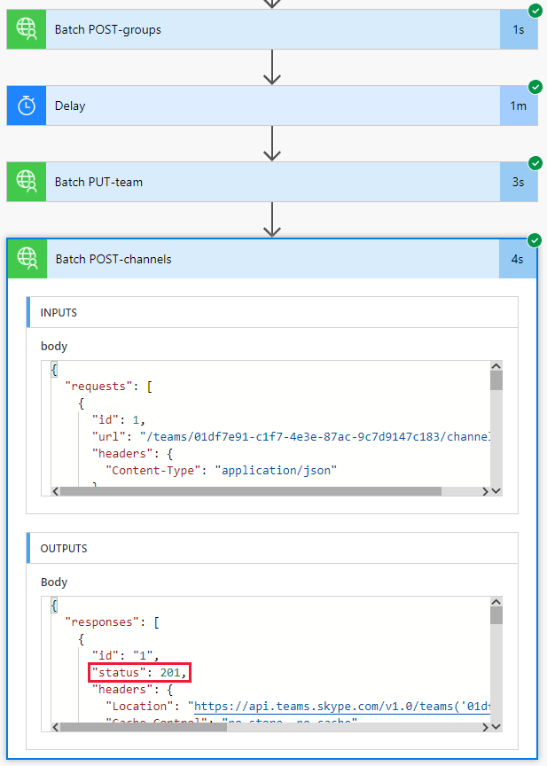

<!-- markdownlint-disable MD002 MD041 -->

<span data-ttu-id="bbbb1-101">Der in der vorherigen Übung erstellte Fluss verwendet die `$batch` API, um zwei einzelne Anforderungen an Microsoft Graph zu stellen.</span><span class="sxs-lookup"><span data-stu-id="bbbb1-101">The Flow you created in the previous exercise uses the `$batch` API to make two individual requests to the Microsoft Graph.</span></span> <span data-ttu-id="bbbb1-102">Das Aufrufen des `$batch` Endpunkts auf diese Weise bietet einige Vorteile und Flexibilität, aber die wahre Leistung des `$batch` Endpunkts wird bei der Ausführung mehrerer Anforderungen an Microsoft Graph in einem einzigen `$batch` Aufruf erfüllt.</span><span class="sxs-lookup"><span data-stu-id="bbbb1-102">Calling the `$batch` endpoint this way provides some benefit and flexibility, but the true power of the `$batch` endpoint comes when executing multiple requests to Microsoft Graph in a single `$batch` call.</span></span> <span data-ttu-id="bbbb1-103">In dieser Übung erweitern Sie das Beispiel zum Erstellen einer einheitlichen Gruppe und zum Verknüpfen eines Teams mit dem Erstellen mehrerer Standardkanäle für das Team in einer einzigen `$batch` Anforderung.</span><span class="sxs-lookup"><span data-stu-id="bbbb1-103">In this exercise, you will extend the example of creating a Unified Group and associating a Team to include creating multiple default Channels for the Team in a single `$batch` request.</span></span>

<span data-ttu-id="bbbb1-104">Öffnen Sie [Microsoft Power Automation](https://flow.microsoft.com) in Ihrem Browser, und melden Sie sich mit Ihrem Office 365 mandantenadministrator Konto an.</span><span class="sxs-lookup"><span data-stu-id="bbbb1-104">Open [Microsoft Power Automate](https://flow.microsoft.com) in your browser and sign in with your Office 365 tenant administrator account.</span></span> <span data-ttu-id="bbbb1-105">Wählen Sie den Fluss aus, den Sie im vorherigen Schritt erstellt haben, und klicken Sie dann auf **Bearbeiten**.</span><span class="sxs-lookup"><span data-stu-id="bbbb1-105">Select the Flow you created in the previous step and choose **Edit**.</span></span>

<span data-ttu-id="bbbb1-106">Wählen Sie **neuer Schritt** aus, und geben Sie `Batch` das Suchfeld ein.</span><span class="sxs-lookup"><span data-stu-id="bbbb1-106">Choose **New step** and type `Batch` in the search box.</span></span> <span data-ttu-id="bbbb1-107">Fügen Sie die **MS Graph Batch Connector** -Aktion hinzu.</span><span class="sxs-lookup"><span data-stu-id="bbbb1-107">Add the **MS Graph Batch Connector** action.</span></span> <span data-ttu-id="bbbb1-108">Wählen Sie die Auslassungspunkte aus, und benennen Sie diese Aktion um `Batch POST-channels` .</span><span class="sxs-lookup"><span data-stu-id="bbbb1-108">Choose the ellipsis and rename this action to `Batch POST-channels`.</span></span>

<span data-ttu-id="bbbb1-109">Fügen **Sie den folgenden Code in das Feld** Text der Aktion ein.</span><span class="sxs-lookup"><span data-stu-id="bbbb1-109">Add the following code into the **body** text box of the action.</span></span>

```json
{
  "requests": [
    {
      "id": 1,
      "url": "/teams/REPLACE/channels",
      "headers": {
        "Content-Type": "application/json"
      },
      "method": "POST",
      "body": {
        "displayName": "Marketing Collateral",
        "description": "Marketing collateral and documentation."
      }
    },
    {
      "id": 2,
      "dependsOn": [
        "1"
      ],
      "url": "/teams/REPLACE/channels",
      "headers": {
        "Content-Type": "application/json"
      },
      "method": "POST",
      "body": {
        "displayName": "Vendor Contracts",
        "description": "Vendor documents, contracts, agreements and schedules."
      }
    },
    {
      "id": 3,
      "dependsOn": [
        "2"
      ],
      "url": "/teams/REPLACE/channels",
      "headers": {
        "Content-Type": "application/json"
      },
      "method": "POST",
      "body": {
        "displayName": "General Client Agreements",
        "description": "General Client documents and agreements."
      }
    }
  ]
}
```

<span data-ttu-id="bbbb1-110">Beachten Sie, dass die drei obigen Anforderungen die [dependsOn](https://docs.microsoft.com/graph/json-batching#sequencing-requests-with-the-dependson-property) -Eigenschaft verwenden, um eine Sequenzreihenfolge anzugeben, und jeder wird eine Post-Anforderung ausführen, um einen neuen Kanal im neuen Team zu erstellen.</span><span class="sxs-lookup"><span data-stu-id="bbbb1-110">Notice the three requests above are using the [dependsOn](https://docs.microsoft.com/graph/json-batching#sequencing-requests-with-the-dependson-property) property to specify a sequence order, and each will execute a POST request to create a new channel in the new Team.</span></span>

<span data-ttu-id="bbbb1-111">Wählen Sie jede Instanz des `REPLACE` Platzhalters aus, und wählen Sie dann im Bereich dynamischer Inhalt den **Begriff Ausdruck** aus.</span><span class="sxs-lookup"><span data-stu-id="bbbb1-111">Select each instance of the `REPLACE` placeholder, then select **Expression** in the dynamic content pane.</span></span> <span data-ttu-id="bbbb1-112">Fügen Sie die folgende Formel in den **Ausdruck** ein.</span><span class="sxs-lookup"><span data-stu-id="bbbb1-112">Add the following formula into the **Expression**.</span></span>

```js
body('Batch_PUT-team').responses[0].body.id
```


<span data-ttu-id="bbbb1-114">Wählen Sie **Speichern** aus, und wählen Sie dann **Test** aus, um den Fluss auszuführen.</span><span class="sxs-lookup"><span data-stu-id="bbbb1-114">Choose **Save** , then choose **Test** to execute the Flow.</span></span> <span data-ttu-id="bbbb1-115">Aktivieren Sie das Optionsfeld **Ich werde das Auslösen der Aktion ausführen** , und wählen Sie dann **& Test speichern** aus.</span><span class="sxs-lookup"><span data-stu-id="bbbb1-115">Select the **I'll perform the trigger** action radio button, then choose **Save & Test**.</span></span> <span data-ttu-id="bbbb1-116">Geben Sie einen eindeutigen Gruppennamen in das Feld **Name** ohne Leerzeichen ein, und wählen Sie **Run Flow** aus, um den Fluss auszuführen.</span><span class="sxs-lookup"><span data-stu-id="bbbb1-116">Enter a unique group name in the **Name** field without spaces, and choose **Run flow** to execute the Flow.</span></span>

<span data-ttu-id="bbbb1-117">Nachdem der Fluss gestartet wurde, klicken Sie auf die Schaltfläche **Fertig** , um das Aktivitätsprotokoll anzuzeigen.</span><span class="sxs-lookup"><span data-stu-id="bbbb1-117">Once the Flow starts, choose the **Done** button to see the activity log.</span></span> <span data-ttu-id="bbbb1-118">Wenn der Fluss abgeschlossen ist, hat die endgültige Ausgabe für die `Batch POST-channels` Aktion eine 201-HTTP-Status Antwort für jeden erstellten Kanal.</span><span class="sxs-lookup"><span data-stu-id="bbbb1-118">When the Flow completes, the final output for the `Batch POST-channels` action has a 201 HTTP Status response for each Channel created.</span></span>



<span data-ttu-id="bbbb1-120">Wechseln Sie zu [Microsoft Teams](https://teams.microsoft.com) , und melden Sie sich mit Ihrem Office 365 mandantenadministrator Konto an.</span><span class="sxs-lookup"><span data-stu-id="bbbb1-120">Browse to [Microsoft Teams](https://teams.microsoft.com) and sign in with your Office 365 tenant administrator account.</span></span> <span data-ttu-id="bbbb1-121">Stellen Sie sicher, dass das soeben erstellte Team angezeigt wird und die drei von der Anforderung erstellten Kanäle enthält `$batch` .</span><span class="sxs-lookup"><span data-stu-id="bbbb1-121">Verify that the team you just created appears and includes the three channels created by the `$batch` request.</span></span>


<span data-ttu-id="bbbb1-123">Während die obige `Batch POST-channels` Aktion in diesem Lernprogramm als separate Aktion implementiert wurde, konnten die Aufrufe zum Erstellen der Kanäle als zusätzliche Aufrufe in der Aktion hinzugefügt werden `Batch PUT-team` .</span><span class="sxs-lookup"><span data-stu-id="bbbb1-123">While the above `Batch POST-channels` action was implemented in this tutorial as a separate action, the calls to create the channels could have been added as additional calls in the `Batch PUT-team` action.</span></span> <span data-ttu-id="bbbb1-124">Dadurch hätte das Team und alle Kanäle in einem einzigen Batch Aufruf erstellt.</span><span class="sxs-lookup"><span data-stu-id="bbbb1-124">This would have created the Team and all Channels in a single batch call.</span></span> <span data-ttu-id="bbbb1-125">Geben Sie dies auf eigene Faust.</span><span class="sxs-lookup"><span data-stu-id="bbbb1-125">Give that a try on your own.</span></span>

<span data-ttu-id="bbbb1-126">Denken Sie schließlich daran, dass [JSON-Batch](https://docs.microsoft.com/graph/json-batching) Aufrufe einen HTTP-Statuscode für jede Anforderung zurückgeben.</span><span class="sxs-lookup"><span data-stu-id="bbbb1-126">Finally, remember that [JSON Batching](https://docs.microsoft.com/graph/json-batching) calls will return an HTTP status code for each request.</span></span> <span data-ttu-id="bbbb1-127">In einem Produktionsprozess empfiehlt es sich, die Nachbearbeitung der Ergebnisse mit einer Aktion zu kombinieren [`Apply to each`](https://docs.microsoft.com/power-automate/apply-to-each) und jede einzelne Antwort mit einem 201-Statuscode zu validieren oder andere erhaltene Statuscodes zu kompensieren.</span><span class="sxs-lookup"><span data-stu-id="bbbb1-127">In a production process, you may want to combine post processing of the results with an [`Apply to each`](https://docs.microsoft.com/power-automate/apply-to-each) action and validate each individual response has a 201 status code or compensate for any other status codes received.</span></span>
